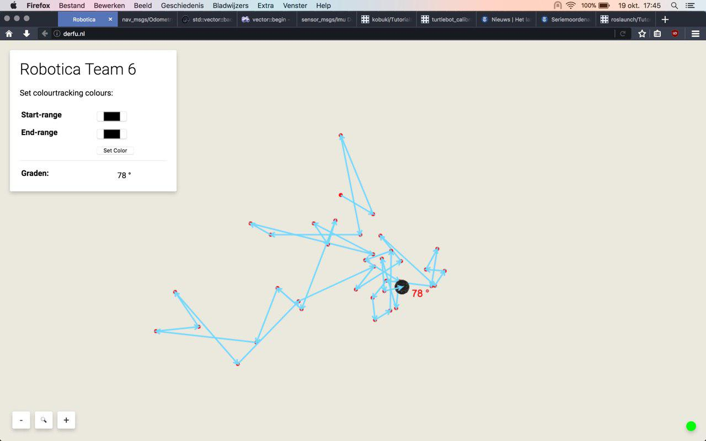
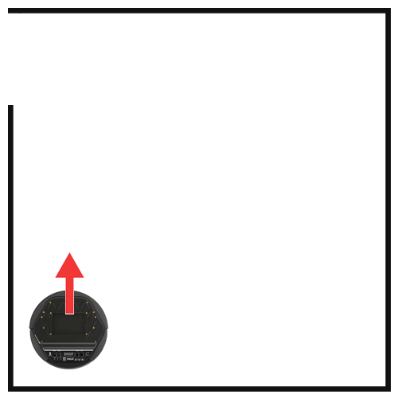
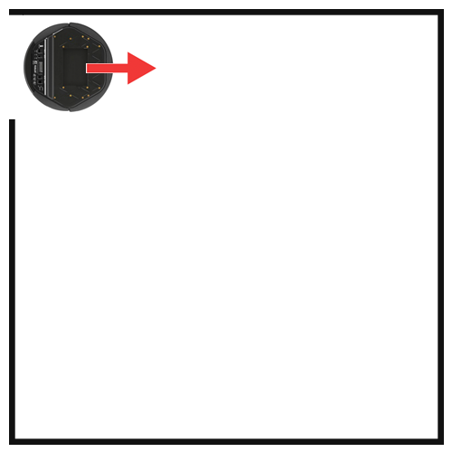
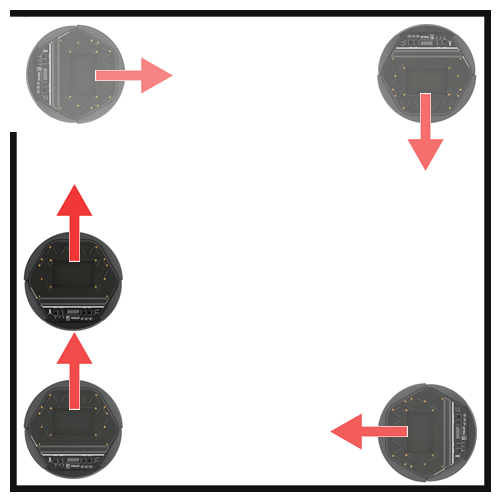

# kobuki mapper

This document describes the way the node 'kobuki_mapper' works. The name 'kobuki_mapper' was chosen because this node first only served as a node to map the environment. Later on we kept working on improving the functionality and it finally it provided the core of our robot.

### Modules

The node is build to work with 'modules'. Every module in the systems adds functionality on its own subject, like battery, bumper, arm, driving and much more. This system creates the possibility to add or change parts of the code without interfering with other parts. All the nodes are inheritance of a class which forces every node to create a constructor, for initializing (example: publishers/advertisers) and a read-method for regulary tasks.

To read everything about how the module systems works and creating your own module I refer to the documentation for that: [How to: add module](kobuki_mapper_add_module.md)

### Mapping

We started this node to work as the map of our kobuki. Everytime the kobuki touched a wall (bump event) it recognized a change of direction:

After this we realized this was not effective if we want to drive previous routes. The kobuki would then just follow the same maybe weird route. So we changed this to a grid system:

We fine tuned this to create an awesome interface:

We added information like:

* Battery percentage
* Speed of the kobuki
* A timer (so we can keep track of time)
* A pop-up message when an object is found
* Driving direction

And later on:

* Autonome driving point system display

The mapping is build on odometry data, every 10 centimeter is 1 tile. Their are no limits on the size of the map.

### Autonome driving

We have worked on creating our own autonomous driving vehicle. Before we had this form we tried many other ways to accomplish it but we think this is the most future-proof.

Our system is based on points. Every time this kobuki has to make a decision on which direction it will drive the system will calculate the most preferred way. This works with points. The kobuki has 360 (0 - 359) points, a circle, to turn to. Every degree has a score, starting from 10. With different sensors and calculations we are subtracting an amount of points of specific degrees.

So for example, if the kobuki is hitting the wall from the front we know we can't move forward anymore. So we decrease from the degrees on the front (around 315 till 45) with maybe 1, 2 or even 3 points. Now we do this with all kind of data and calculate our favorite turn.

The data that we have used so far is:

* Bumper, when the bumper is pressed we subtract 1 point from the direction of the pressed bumper.
* Ultrasonic sensors, we have 4 ultrasonic sensors in every direction. When the measurement is below value x we subtract 2 points.
* Old location data, when the kobuki already visited the tile(s) next to the current tile the degrees on that side will subtract 1 point.

#### example

To demonstrate how our system works I have created a visualization of a use-case. In this case the kobuki has to leave the room:

In this image the kobuki is placed in the left bottom and directed to the top. When the 'kobuki mapper' program is started it will drive forward untill a few centimeters before the wall. Now it has to make a decision on which way to turn.

0 - 359 degrees all have 10 points.

Because the front is blocked (seen by ultrasonic) we subtract 2 points from 315 till 45 degrees. So these have 8 points left.

The left side is clear, so 10 points here. The same for the rights side, also 10 points. 

We came from the bottom we have already visited this tile, so we subtract 1 point from the bottom.

So:

> Top: 8 points  
> Right: 10 points  
> Bottom: 9 points  
> Left: 10 points

The program prefers right, because left and right have the same score it will go right.

So the kobuki turns, and will resume the program. When it cannot drive further it will do the same and calculate a new direction.

Now are we driving in squared circles you would say with the above situation. But because of the points system it will do something different:

When the kobuki is back on driving into the first wall, it will almost have the same points as previous but the difference is the right side is already visited by the kobuki. So we subtract 1 more point from the right:

> Top: 8 points  
> Right: 9 points  
> Bottom: 9 points  
> Left: 10 points

And now instead of going right, it will go left.

#### Improvements

* Substract point(s) on which measurement of ultrasonic sensors (left or right) is lower. So the kobuki will turn in the direction with most chance on space.
* When clicking on the map on the website the kobuki should drive to that point.
* Some way to control the arm from the website, resetting and picking up objects or something.